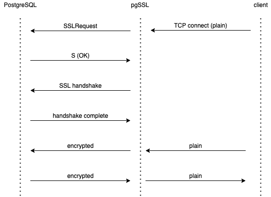

# pgSSL
pgSSL is a proxy for PostgreSQL that wraps plain TCP connections (```sslmode=disable```) into SSL and provides client certificate to the backend Postgres server. This way it allows SSL encryption between itself and PostgresSQL and certificate-based authentication for plain-text client.

### Motivation
PostgreSQL listens to both plain and SSL connections on a single port, therefore it has its own handshake that precedes the SSL handshake.
For this reason it's not possible to wrap plain connections into SSL with usual proxies like nginx, envoy, istio, HAproxy.
Though pgbouncer can be used for such task, the purpose of pgbouncer is to load-balance and pool the connections, so for a simple SSL-wrap it seems to be overkill.
pgSSL wraps connections with regard to PostgreSQL-specific SSL handshake.

### How it works


### Installation
```go get -u github.com/glebarez/pgssl```

### Usage example
```pgssl -p postgres-server:5432 -l :15432 -k client.key -c client.crt```