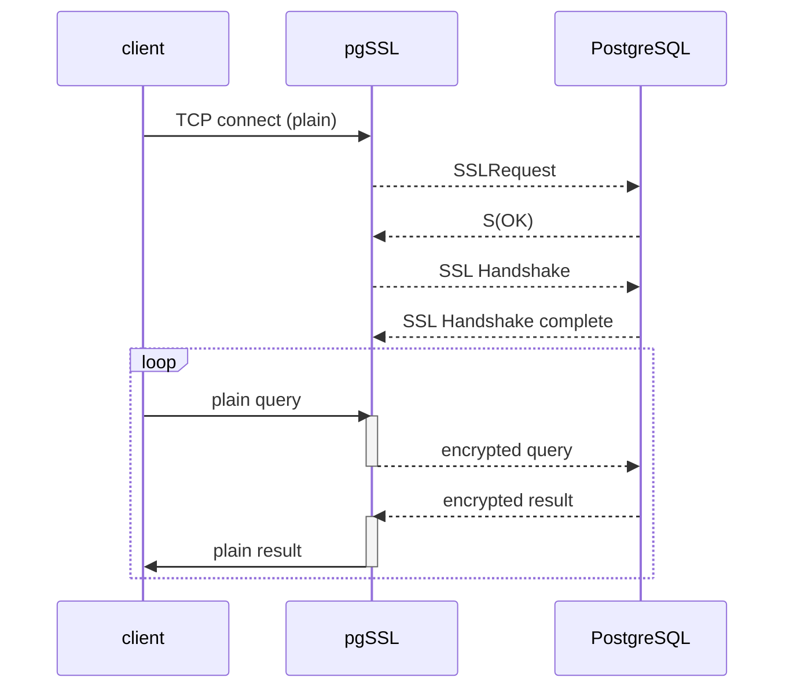

# pgSSL
```pgSSL``` is a proxy for ```PostgreSQL``` that wraps plain TCP connections (```sslmode=disable```) into SSL and provides (optional) client certificate to the backend ```PostgreSQL``` server. This way it allows SSL encryption and certificate-based authentication for plain-text ```PostgreSQL``` clients.

### Motivation
PostgreSQL listens to both plain and SSL connections on a single port, therefore it has its own handshake that precedes the usual SSL/TLS handshake.
For this reason it's not possible to wrap plain connections into SSL with usual proxies like ```nginx```, ```envoy```, ```istio```, ```HAproxy```.
Though ```pgbouncer``` can be used for such task, the purpose of ```pgbouncer``` is to load-balance and pool the connections, so for a simple SSL-wrap it seems to be overkill.
```pgSSL``` wraps connections with regard to PostgreSQL-specific SSL handshake.

### How it works


### Installation
```go install github.com/glebarez/pgssl```

### Usage examples
- ```pgssl -p postgres-server:5432 -l :15432 -k client.key -c client.crt```
- ```pgssl -p postgres-server:5432 -l :15432```
- ```PGSSL_PASSWORD=changeme pgssl -p postgres-server:5432 -l :15432```